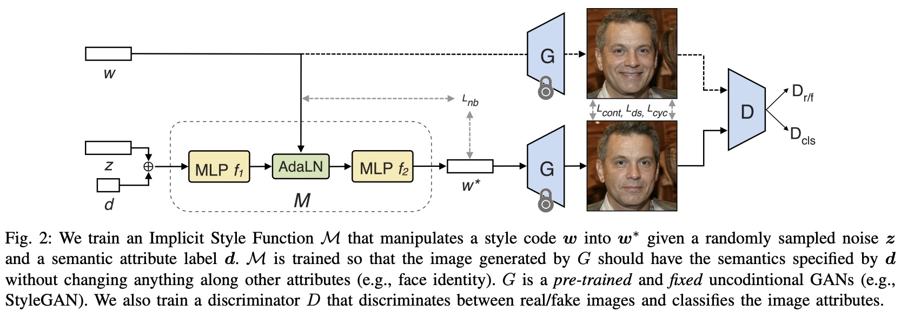

# ISF-GAN: An Implicit Style Function for High-Resolution Image-to-Image Translation

)

To appear in [TMM 2022](https://ieeexplore.ieee.org/document/9735294).

[[paper]](https://ieeexplore.ieee.org/document/9735294)[[arXiv]](https://arxiv.org/pdf/2109.12492.pdf)[[code]](https://github.com/yhlleo/stylegan-mmuit)  
[Yahui Liu](https://yhlleo.github.io/)1,3, 
Yajing Chen2, 
[Linchao Bao](http://linchaobao.github.io/)2, 
[Nicu Sebe](https://scholar.google.com/citations?user=stFCYOAAAAAJ&hl=en)1,  
[Bruno Lepri](https://scholar.google.com/citations?hl=en&user=JfcopG0AAAAJ)3, 
[Marco De Nadai](https://scholar.google.com/citations?user=_4-U61wAAAAJ&hl=en)3  
1University of Trento, Italy, 2Tencent AI Lab, China, 3Bruno Kessler Foundation, Italy.  

## Codes

Coming soon ...